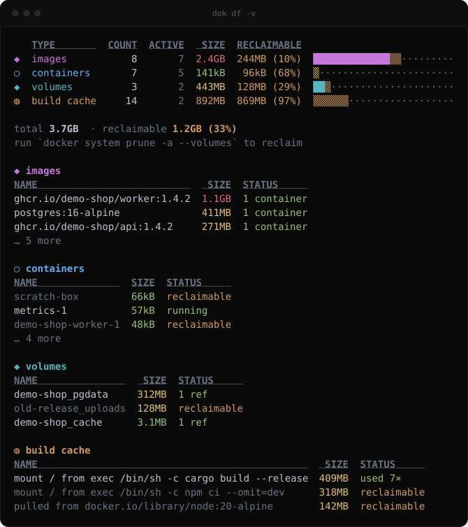
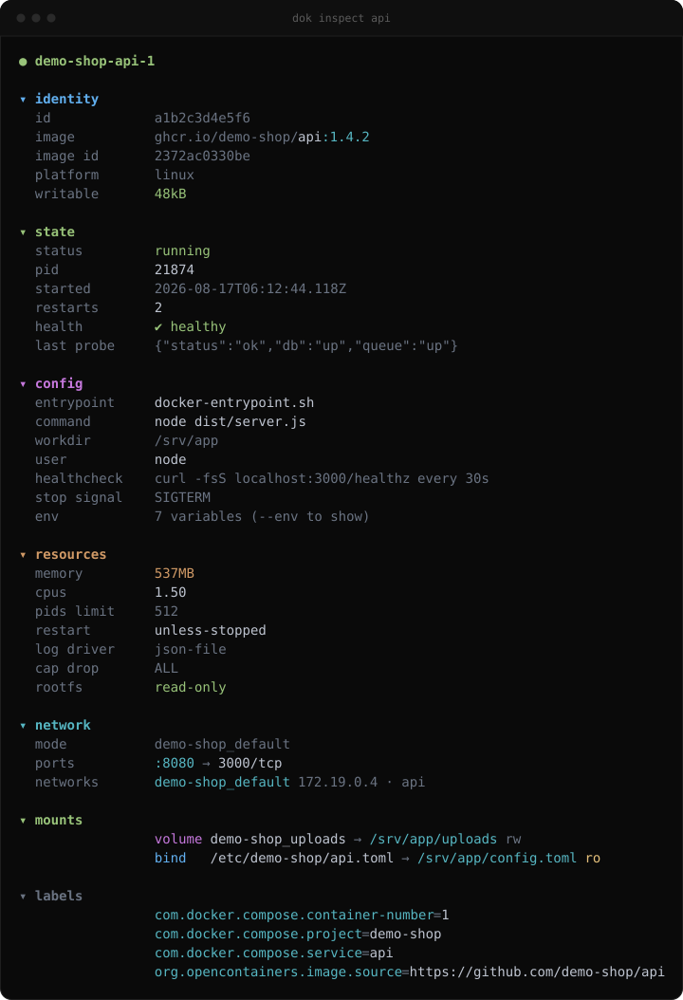
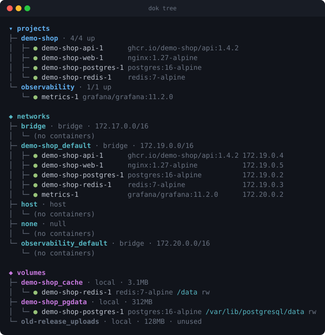
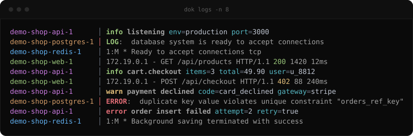
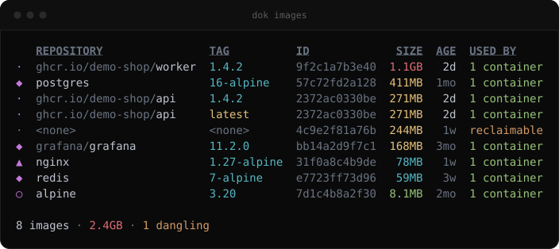
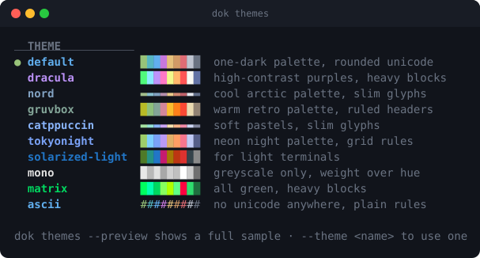

<div align="center">

# cool-docker-commands

**Docker output, made readable — what [eza](https://eza.rocks/) is to `ls`.**

One binary: **`dok`**.

[](https://github.com/alsaadii98/cool-docker-commands/actions/workflows/ci.yml)
[](https://github.com/alsaadii98/cool-docker-commands/releases)
[](https://crates.io/crates/dok-cli)
[](LICENSE)



</div>

## What it is

`docker ps` prints a wall of text that wraps on any normal terminal. `docker
inspect` prints 400 lines of JSON. `docker system df` gives you a number but not
the image that ate the disk.

`dok` — the single binary this repo ships — reads the same data straight from
the Docker socket, no shelling out, and renders it for humans:

- **Colour and icons that mean something**: state, health, size, age.
- **Grouped by compose project**, showing the service name rather than the
  mangled container name.
- **Human sizes and ages** (`1.1GB`, `3h`), not raw bytes and timestamps.
- **Themes** that change palette, glyphs *and* layout — including a pure-ASCII
  one for CI logs and serial consoles.
- **One static screen per command**, so it pipes, greps and scrolls like any
  other Unix tool. No full-screen app to live in (except `dok stats`, which is
  explicitly a dashboard).

## Install

<details open>
<summary><b>Homebrew</b> (macOS, Linux)</summary>

```sh
brew install alsaadii98/tap/dok
```
</details>

<details>
<summary><b>Cargo</b> (any platform with Rust 1.88+)</summary>

```sh
cargo install dok-cli
```

The crate is `dok-cli`; the binary it installs is `dok`.
</details>

<details>
<summary><b>Arch Linux</b> (AUR)</summary>

```sh
paru -S dok-bin      # prebuilt binary
paru -S dok          # build from source
```
</details>

<details>
<summary><b>Debian / Ubuntu</b></summary>

```sh
curl -LO https://github.com/alsaadii98/cool-docker-commands/releases/latest/download/dok_amd64.deb
sudo dpkg -i dok_amd64.deb
```
</details>

<details>
<summary><b>Fedora / RHEL</b></summary>

```sh
curl -LO https://github.com/alsaadii98/cool-docker-commands/releases/latest/download/dok.x86_64.rpm
sudo rpm -i dok.x86_64.rpm
```
</details>

<details>
<summary><b>Nix</b></summary>

```sh
nix run github:alsaadii98/cool-docker-commands
nix profile install github:alsaadii98/cool-docker-commands
```
</details>

<details>
<summary><b>Windows</b> (Scoop)</summary>

```sh
scoop bucket add dok https://github.com/alsaadii98/cool-docker-commands
scoop install dok
```
</details>

<details>
<summary><b>Prebuilt binary</b></summary>

Grab the archive for your platform from the
[releases page](https://github.com/alsaadii98/cool-docker-commands/releases):

```sh
tar xzf dok-*.tar.gz
sudo mv dok /usr/local/bin/
```
</details>

<details>
<summary><b>From source</b></summary>

```sh
git clone https://github.com/alsaadii98/cool-docker-commands
cd cool-docker-commands
cargo build --release
sudo cp target/release/dok /usr/local/bin/
```
</details>

**Try it without a daemon:** every command takes `--demo`, which renders a
built-in example stack. That is also how the screenshots in this README are
generated, so they never leak anyone's real containers.

```sh
dok ps -a --demo
dok df -v --demo
```

**Requirements:** a reachable Docker daemon. `dok` honours `DOCKER_HOST`, the
default `/var/run/docker.sock`, and Windows named pipes. Nothing else.

## Commands

| Command | What it does |
|---|---|
| `dok ps` (`ls`) | Containers grouped by compose project — id, state dot, health mark, `:8080→80` ports, relative age |
| `dok images` (`img`) | Images with size and age gradients, dangling marked reclaimable |
| `dok df` (`du`) | Disk usage per category with used/reclaimable bars, plus the biggest offenders |
| `dok inspect` | The 400-line inspect JSON folded into readable sections, secrets masked |
| `dok logs` | Interleaved multi-container tail with level colouring and JSON pretty-printing |
| `dok top` | Processes inside containers, nested by parent PID |
| `dok tree` | Compose projects, networks (with IPs) and volumes (with mount points) |
| `dok stats` | Live CPU / memory / IO dashboard |
| `dok events` | Daemon event stream, colour-coded by type and action |
| `dok themes` | List and preview themes |

<details>
<summary><b>dok df</b> — where the disk went</summary>



```sh
dok df                # summary with used|reclaimable bars
dok df -v             # + biggest images, containers, volumes, cache entries
dok df -v --top 20
```
</details>

<details>
<summary><b>dok inspect</b> — the JSON, folded</summary>



```sh
dok inspect api
dok inspect api --env                 # include environment variables
dok inspect api --env --show-secrets  # unmask PASSWORD/TOKEN/... values
```

Values of credential-looking env keys are masked by default. Privileged mode,
added capabilities, OOM kills and failing healthchecks are called out in colour.
</details>

<details>
<summary><b>dok tree</b> — projects, networks, volumes</summary>



```sh
dok tree
dok tree --only networks
dok tree -a           # include stopped containers
```
</details>

<details>
<summary><b>dok logs</b> — merged and level-coloured</summary>



```sh
dok logs                  # tail every running container
dok logs api db -f        # follow two of them
dok logs api -n 200 -t    # 200 lines with timestamps
dok logs api -g error     # filter to matching lines
```

Each container keeps a stable colour. The `│` separator turns red for stderr.
JSON lines are exploded into `level msg key=value …`.
</details>

<details>
<summary><b>dok images</b></summary>



```sh
dok images            # sorted by size, biggest first
dok images -s age
dok images --dangling
```
</details>

<details>
<summary><b>dok events / top / stats</b></summary>

```sh
dok events --since 2h            # relative durations work
dok events -T container,volume   # restrict to object types
dok events --exec                # include noisy exec_* events

dok top                          # processes in every running container
dok top api --ps-args "-eo pid,ppid,rss,args"

dok stats                        # live dashboard; q quits, s cycles sort
```
</details>

## Themes

A theme is not just colour. It carries a **palette** (nine semantic roles), a
**glyph set** (state dots, tree stubs, bars, arrows, separators) and a
**layout** (header treatment, gutter width, rules, column separators).



```sh
dok themes              # list with swatches
dok themes --preview    # full sample table per theme
dok ps --theme gruvbox
DOK_THEME=nord dok ps
```

Built in: `default`, `dracula`, `nord`, `gruvbox`, `catppuccin`, `tokyonight`,
`solarized-light`, `mono`, `matrix`, `ascii`.

## Configuration

```sh
dok themes --init       # writes ~/.config/dok/config.toml
```

```toml
theme = "mine"
icons = "nerd"          # auto | nerd | unicode | none

[themes.mine]
base = "gruvbox"        # start from any built-in
glyphs = "heavy"        # unicode | ascii | heavy | slim
layout = "grid"         # default | ruled | grid | quiet | ascii
header = "dim"          # underline | bold | dim | caps
gutter = 3
green = "#00ff00"       # override any palette role
```

Theme precedence: `--theme` → `DOK_THEME` → config file → `default`.

Global flags, valid on every command:

```
--color auto|always|never       # auto respects NO_COLOR and non-tty output
--icons auto|nerd|unicode|none  # auto picks nerd glyphs on capable terminals
--theme <name>
```

Set `DOK_NERD_FONT=1` to force Nerd Font glyphs, `DOK_NERD_FONT=0` to refuse
them.

## How it compares

| | `dok` | `docker ps --format` | [dops](https://github.com/Mikescher/better-docker-ps) | [lazydocker](https://github.com/jesseduffield/lazydocker) / [oxker](https://github.com/mrjackwills/oxker) |
|---|---|---|---|---|
| Static, pipeable output | ✔ | ✔ | ✔ | ✘ (full-screen TUI) |
| Compose grouping | ✔ | ✘ | ✘ | partial |
| Readable `inspect` | ✔ | ✘ | ✘ | partial |
| Disk usage breakdown | ✔ | ✘ | ✘ | partial |
| Themes (palette + glyphs + layout) | ✔ | ✘ | ✘ | ✘ |
| Interactive control (exec, restart) | ✘ | ✘ | ✘ | ✔ |

`dok` is not trying to replace lazydocker — use that when you want to *drive*
containers, and `dok` when you want to *read* them.

## Contributing

Issues and PRs welcome — see [CONTRIBUTING.md](CONTRIBUTING.md) for the dev
loop, and [ROADMAP.md](ROADMAP.md) for what is planned and what is up for grabs.

```sh
cargo fmt --all
cargo clippy --all-targets -- -D warnings
cargo test
```

## License

MIT - Built by [@alsaadii98](https://github.com/alsaadii98). See [LICENSE](LICENSE).
